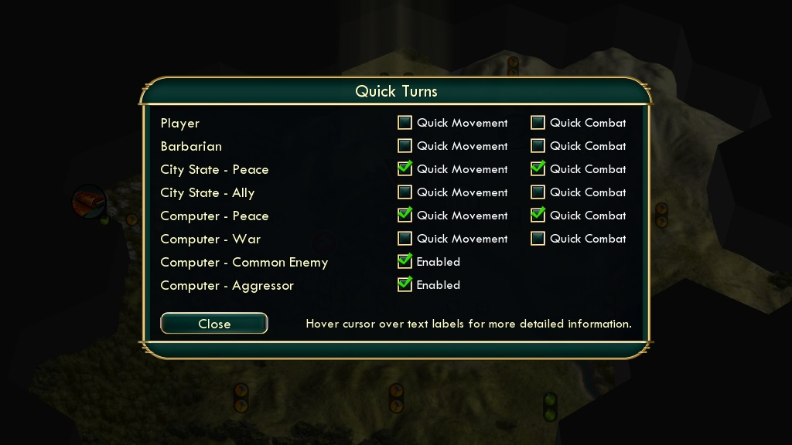
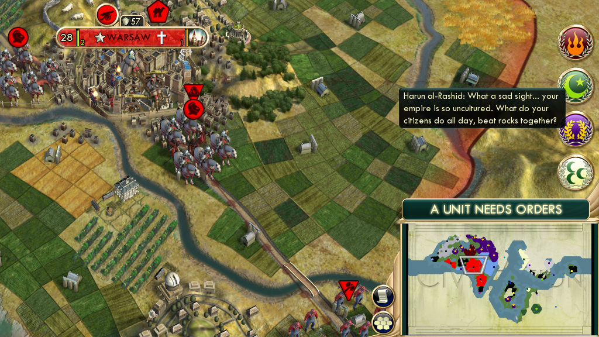

Civilization V Mods
====

[Quick Turns](http://steamcommunity.com/sharedfiles/filedetails/?id=220250184) 
----

Intelligently toggles Quick Movement/Combat during AI turns, which results in significantly reduced time you will spend waiting and watching what the AI does instead of actually playing, especially in the late game. Only important AI unit actions, relevant to the player are shown. Replacement for playing with permanently enabled Quick Movement/Combat or in the Strategic 2D view when turn times slow down to a crawl. You can now enjoy the cool nuclear explosions and most* unit animations without major compromises!

[Quiet Diplomacy](http://steamcommunity.com/sharedfiles/filedetails/?id=309175632)
----

Replaces some of the annoying leader screen popups (where decisions don't have any effect on the game) with notifications above the minimap. This results in much faster AI turns since you don't have to click them to resume turn processing.

License
====

The MIT License (MIT)

Copyright (c) 2016 Piotr Doan

Permission is hereby granted, free of charge, to any person obtaining a copy of this software and associated documentation files (the "Software"), to deal in the Software without restriction, including without limitation the rights to use, copy, modify, merge, publish, distribute, sublicense, and/or sell copies of the Software, and to permit persons to whom the Software is furnished to do so, subject to the following conditions:

The above copyright notice and this permission notice shall be included in all copies or substantial portions of the Software.

THE SOFTWARE IS PROVIDED "AS IS", WITHOUT WARRANTY OF ANY KIND, EXPRESS OR IMPLIED, INCLUDING BUT NOT LIMITED TO THE WARRANTIES OF MERCHANTABILITY, FITNESS FOR A PARTICULAR PURPOSE AND NONINFRINGEMENT. IN NO EVENT SHALL THE AUTHORS OR COPYRIGHT HOLDERS BE LIABLE FOR ANY CLAIM, DAMAGES OR OTHER LIABILITY, WHETHER IN AN ACTION OF CONTRACT, TORT OR OTHERWISE, ARISING FROM, OUT OF OR IN CONNECTION WITH THE SOFTWARE OR THE USE OR OTHER DEALINGS IN THE SOFTWARE.
